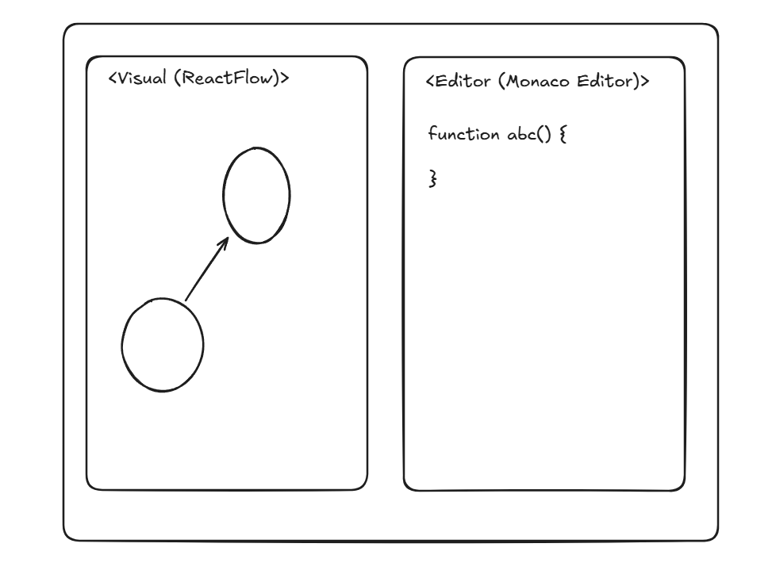

# From Code to Category Theory

## Author

[Poom Yimyuean (lebrancconvas)](https://github.com/lebrancconvas)

## Detail

### Business Domain or Category

- Code Editor and Visual.

### Project Description

Mapping the concept between Functional Programming to Category Theory by translating
TypeScript (or any language) into Category of Type (under the diagram abstraction based on Category Theory).

### Why

I just want to try to map Functional Programming to Theoretical Category Theory.

## Overall architecture

[Insert your overall architecture here]

## Possible Architecture

### Sketch Concept

### UI Design

### Plan

- Functional Requirement
  - [ ] Have an editor section and a visual diagram section.
  - [ ] User can write code (TypeScript for the first version) in the editor section.
    - [ ] Automatically Generated or Click to generate?
- Non-Functional Requirement
  - [ ] Have an option to swap editor section and visual diagram section.
  - [ ] R E S P O N S I V E     D E S I G N
  - [ ] P E R F O R M A N C E (like generated time.)

### Tech Stack

- **Front-End**
  - *Programming Language*
    - TypeScript: My Best Language Waifu :P
  - *Framework / Library*
    - NextJS (built with PNPM): I just want to practice NextJS skill so I decided to use it.
    - Monaco Editor: For making an editor.
    - ReactFlow: For making a diagram.

---
*Template for a freestyle idea. Feel free to explore your proof of concept 😁.*
