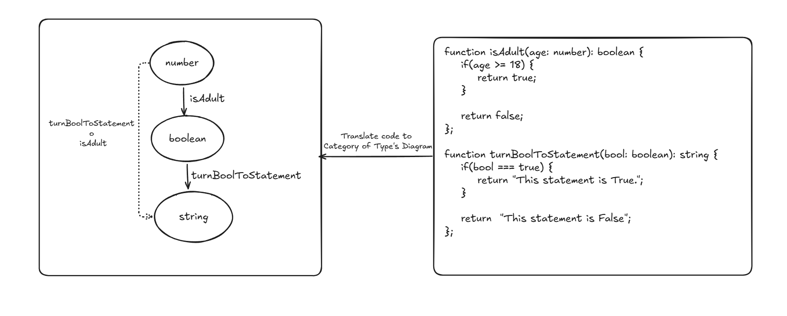

# Category Theory Simulation

## Author

[Poom Yimyuean (lebrancconvas)](https://github.com/lebrancconvas)

## Detail

### Business Domain or Category

- Functional Programming and Category Theory.

### Project Description

Mapping the concept between Functional Programming to Category Theory by translating
TypeScript (or any language) into Category of Type (under the diagram abstraction based on Category Theory).

### Why

## Overall architecture

[Insert your overall architecture here]

## Possible Architecture

### Sketch Concept

### Tech Stack

- **Front-End**
  - *Programming Language*
    - TypeScript
  - *Framework / Library*
    - NextJS (built with PNPM)

---
*Template for a freestyle idea. Feel free to explore your proof of concept 😁.*
